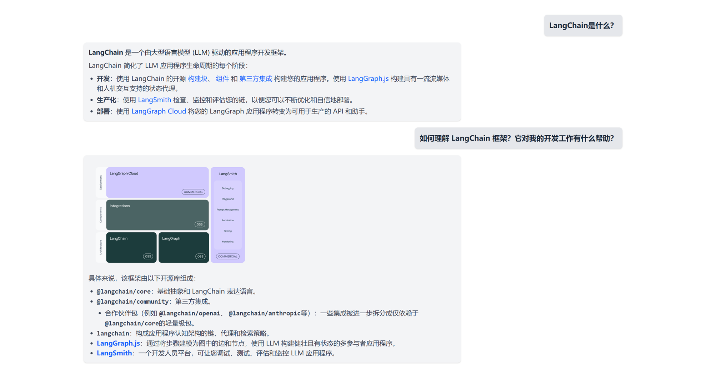

<h1 align="center">对话框Dialog</h1>

```sh
git add .
git commit -m "first commit"
git checkout -b Dialog
git remote add origin git@github.com:lushiheng123/front-project.git
git push -u origin Dialog
```


