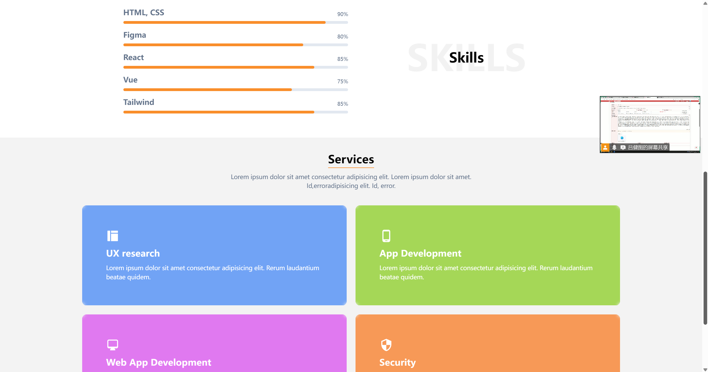

<h1 align="center">一个适合个人简历的界面</h1>

```sh
git init
git add .
git commit -m "first commit"
git checkout -b Page2
git remote add origin git@github.com:lushiheng123/front-project.git
git push -u origin Page2
```

# 1. 演示




# 2. 通过`id=___`加上`href=#`的方式可以在本页面快速定位

# 3. `href`提供邮件和下载的功能


# 4. 提供字中字


# 5. 提供百分之多少的样式


# 6. 好看的卡片样式


